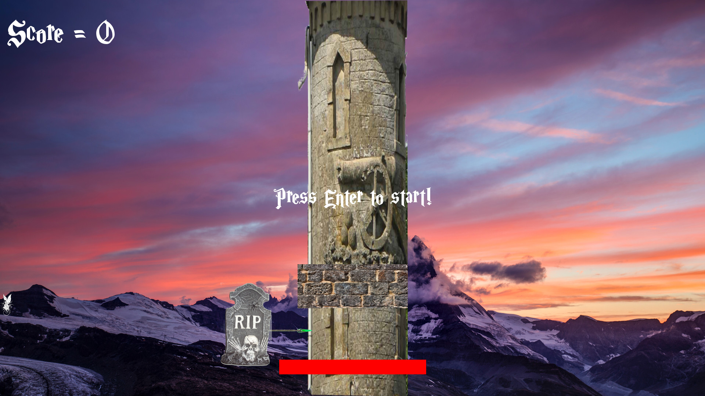

# Rapunzel
## Table of Contents
* [General info](#General-info)
* [Collaborators](#Collaborators)
* [Technologies](#Technologies)
* [Setup](#Setup)
* [Usage](#Usage)
* [Minimum hardware requirements](#Minimum-hardware-requirements)
* [Screenshots](#Screenshots)
* [Project status](#Project-status)
* [Release date](#Release-date)
* [Sources](#Sources)
* [Contact](#Contact)

## General info
Rapunzel is a simple C++ game based on Timber!, which is the first lesson in Beginning C++ Game Programming, 2nd ed. by John Horton. Timber is, in turn, based on Timberman on Steam.
Rapunzel requires the 32-bit versions of SFML 2.6.2 and the corresponding GCC 13.1.0 mingw. I configured my environment in CodeBlocks, but John Horton recommends using Visual Studio Code.
I changed the game from a Timber clone with a lumberjack chopping down a tree and avoiding the branches to a wizard attacking a tower with a staff and avoiding Rapunzel's braids.
All graphics, sounds, and fonts are used under the Creative Commons License, public domain, free for personal/non-commercial use, and similar licenses or terms of use.

## Collaborators
Jason Ash, Computer Science Major

## Technologies
Although Rapunzel was programmed and compiled in CodeBlocks for Windows, John Horton mentions that the projects in his book can be built in Linux and on Macs.

## Setup
1. Download codeblocks-25.03mingw-setup.exe from https://www.codeblocks.org/downloads/binaries/
2. Download GCC 13.1.0 MinGW (DW2) - 32-bit and WinLibs MSVCRT 13.1.0 (32-bit; in the yellow box with red text at the top of the Webpage) from https://www.sfml-dev.org/download/sfml/2.6.2/
3. Extract both of those in suitable folders/directories.
4. Watch the YouTube video by FF Dev on how to set up your CodeBlocks to use SFML at https://www.youtube.com/watch?v=NxB2qsUG-qM&t=556s
5. Alternatively, you could follow the tutorial in the book by John Horton for Visual Studio Code (but I didn't have any luck getting it to work that way).
6. Download main.cpp, Timber2.cbp, Timber2.depend, Timber2.layout, the .png graphics files, the font, cb.bmp, and the sound .wav files from this repository.
7. Relative to main.cpp, place the .png files in a subfolder called "graphics", the .wav files in a subfolder called "sounds", and the .ttf in a subfolder called "fonts".
8. In addition to the instructions in the YT video above, under project build options, under Debug Linker settings, make sure to add sfml-audio-d. Likewise, under the Linker settings for Release, add sfml-audio.
    Ymmv, but failure to do this step could result in:
* The sound effects not working, and
* By not doing so at first, I left the audio on my computer in such a state that I had to restart it to even watch a YouTube video. My audio returned to normal function after restarting.
9. Turn down the volume on your computer since the sound effects are quite loud.   
10. Compile the .cpp source file in CodeBlocks, and enjoy the game.

## Usage
* The game starts "paused" at a screen similar to the end game screen and prompts the user to press the Enter key.
* Use the right arrow key to attack the tower at the right side of it, and the left arrow key to attack the tower from the left side. Each time the tower is attacked, one is added to the score.
* Each time you attack the tower, Rapunzel's heavy braids come down one position.
* If one of them makes contact with the wizard, he dies, a death wail sound is played, a message displays saying "SQUISHED", and the player must press the Enter key to start another game.
* By attacking the tower, you add to the time remaining, but per the game mechanics, less time keeps getting added the longer gameplay is in progress.
* If you run out of time, a message displays saying, "Out of time!! (This is the second way to lose the game.)
* Press the Esc key at any time to exit the game.

## Minimum hardware requirements
Any computer that is at least a Pentium 4 with 1 or 2 GB of system RAM running Windows 7 SP1 or later with sufficient hard drive space should be able to play this game.

## Screenshots

## Project Status
Released on GitHub as-is.

## Release date
22 June, 2025

## Sources
Horton, John. Beginning C++ Game Programming, 2nd ed., Packt Publishing, 2019.
The graphics .png files in my project were edited using GIMP and .wav sound files using Audacity.
The following graphics, sounds, and fonts used in this game and uploaded to this repository are derived from the following sources:
* playerLeft.png and playerRight.png from Wizard by Firkin on https://openclipart.org/detail/229148/wizard (public domain)
* wizardTower.png from Kehlen tower.jpg by Jonny Chicago on https://commons.wikimedia.org/wiki/File:Kehlen_tower.jpg (GNU Free Documentation License)
* fairy.png on https://vectorportal.com/vector/fairy-vector.ai/8216 (Creative Commons Attribution License/royalty free)
* background.png from Mountain Landscape Free Stock Image by Sam Ferrar at https://stocksnap.io/photo/mountain-landscape-D9QN84B8D8 (Commons Deed/public domain)
* staffLeft.png and staffRight.png from Low-Tier Mage Staff by slipled at https://www.deviantart.com/slipled/art/Low-Tier-Mage-Staff-1123583629 (Creative Commons Non-Commercial License)
* braid.png from Close-up Braided Hair of Blonde Woman by Irina Kaminshaya at https://www.pexels.com/photo/close-up-of-braided-hair-of-blonde-woman-12705360/ (Free to use)
* stoneblock.png at https://pxhere.com/en/photo/874912 (CC0 Public Domain)
* punch-a-rock.wav from "Punch a Rock" by LordSonny at https://pixabay.com/sound-effects/search/hit%20stone/ (Royalty free, turn down your volume before listening since this one is loud).
* out_of_time.wav from "Out of Breath (Male) by VoiceBosch at https://pixabay.com/sound-effects/search/out%20of%20time/ (Royalty free)
* death.wave from "Male Death Scream Horror" by Universfield at https://pixabay.com/sound-effects/search/death/ (Royalty free, also turn down your volume before listening since this one is loud, too).
* MagicSchoolOne.ttf from Magic School Font Family by FontMesa at https://www.1001fonts.com/magic-school-font.html (Free for Commercial Use License).

## Contact
Jason Ash - wizardofki@gmail.com
